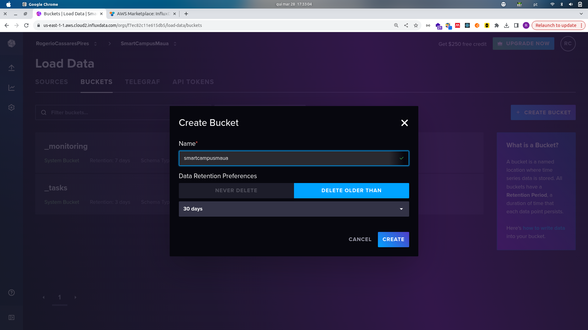
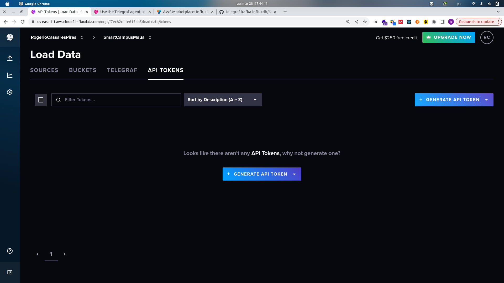
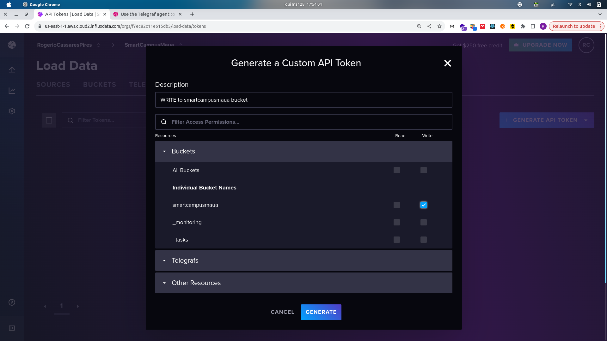
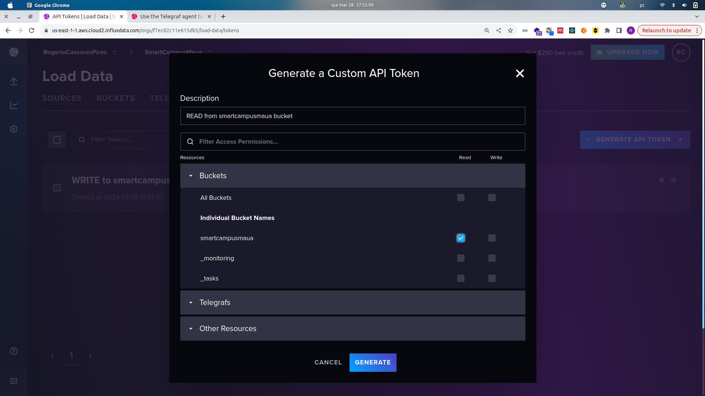

# OpenDataTelemetry

The core of OpenDataTelemetry Stack is a set of gateway services connected to an Apache Kafka Brokers that distribute realtime data stream publishing in a MQTT Broker for instant messages an a timeseries api to retrieve historical data from an InfluxDB database.


## QuickStart
* Make the default OpenDataTelemetry directory:
```yaml
mkdir -p ~/Git/OpenDataTelemetry
```
* Run local MQTT, Kafka, Telegraf to InfluxDB Cloud and Telegraf to MQTT via `docker-compose.yaml`:
```yaml
cd ~/Git/OpenDataTelemetry
git clone https://github.com/OpenDataTelemetry/OpenDataTelemetry.git
cd ~/Git/OpenDataTelemetry/OpenDataTelemetry
docker compose up
```
* Run gateway-mqtt-lns-imt with local decoded and simulator:
```yaml
cd ~/Git/OpenDataTelemetry
# Edit go.mod to set local decode. See detailed instructions.
git clone https://github.com/OpenDataTelemetry/gateway-mqtt-lns-imt.git 
git clone https://github.com/OpenDataTelemetry/decode.git
cd gateway-mqtt-lns-imt
go mod tidy
go run main.go
go run simulator/main.go
```
* Run timeseries-api:
```yaml
cd ~/Git/OpenDataTelemetry
git clone https://github.com/OpenDataTelemetry/timeseries-api.git 
cd timeseries-api
go mod tidy

INFLUXDB_URL=https://us-east-1-1.aws.cloud2.influxdata.com \
  INFLUXDB_DATABASE=smartcampusmaua \
  INFLUXDB_TOKEN="INFLUX_READ_TOKEN_HERE" go run main.go
```
* Subscribe to a Topic and listen for simulator data at MQTT:
```yaml
mosquitto_sub -h localhost -t "application/+/node/+/rx"
```
* Subscribe to a Topic and listen for decoded JSON data at MQTT:
```yaml
mosquitto_sub -h localhost -t "SmartCampusMaua/#"
```

## Develop Environment

The develop environment comprises a docker-compose.yaml file with an MQTT Broker with no password required, an Apache Kafka Broker and Telegrafs configuration files. One Telegraf configuration file connect to the Kafka Broker and Write to InfluxDB while the other publishes to a MQTT Broker.

Thus, the developer shall focus on establish a connection with the source of the data, decoding it and sending it to the Kafka Broker with the gateways inputs and generating solutions on how work with the decoded data in realtime and analyzes it using a MQTT subsriber service ans the timeseries-api outputs. 

So, download this repository and run the Brokers and Telegrafs files to Write to and external and cloud hosted InfluxDB database powered with v3.0 engine.

## Prerequirements:
* Docker Engine installed in Linux or WSL2;
* InfluxDB Cloud account with a bucket and `READ` and `WRITE` tokens;
* Install `mosquitto-clients` from Linux Apt repository in Linux or WSL2;
* Install `golang` tools in Linux or WSL2 or Windows.

### Install WSL2 (Only Windows)
Open PowerShell as Admin the run:
```bash
wsl --install
```
Choose Ubuntu as OS and configure the [Windows Terminal](https://apps.microsoft.com/detail/9n0dx20hk701?hl=pt-br&gl=BR) to use as default.

### Install Docker Engine
Open the Terminal (WSL2, Linux), then enter line by line:
```bash
# Add Docker's official GPG key:
sudo apt-get update
sudo apt-get install ca-certificates curl
sudo install -m 0755 -d /etc/apt/keyrings
sudo curl -fsSL https://download.docker.com/linux/ubuntu/gpg -o /etc/apt/keyrings/docker.asc
sudo chmod a+r /etc/apt/keyrings/docker.asc

# Add the repository to Apt sources:
echo "deb [arch=$(dpkg --print-architecture) signed-by=/etc/apt/keyrings/docker.asc] https://download.docker.com/linux/ubuntu $(. /etc/os-release && echo "$VERSION_CODENAME") stable" | sudo tee /etc/apt/sources.list.d/docker.list > /dev/null

# Update the Apt repositories
sudo apt-get update

# Install packages
sudo apt-get install docker-ce docker-ce-cli containerd.io docker-buildx-plugin docker-compose-plugin

# Test the installation
sudo docker run hello-world

# Add current user to docker group
sudo groupadd docker
sudo usermod -aG docker $USER

# Logout reboot then, test without the sudo command
docker run hello-world
```
### Create InfluxDB account and set the bucket and its tokens
Create InfluxDB Account, then:
* Start New Bucket:


* Generate API Tokens:


* Write to smartcampusmaua bucket:


* READ from smartcampusmaua bucket:


### Install mosquitto-clients
Open the Terminal (WSL2, Linux), then enter:
```bash
sudo apt update
sudo apt install mosquitto-clients
```

### Install golang tools
From: https://go.dev/doc/install

* LInux, WSL2:
Install the binaries to `/usr/local`:
```bash
sudo rm -rf /usr/local/go && sudo tar -C /usr/local -xzf go1.22.1.linux-amd64.tar.gz
```
Then set /usr/local/go to the PATH by adding the following line to `$HOME/.profile`:
```bash
export PATH=$PATH:/usr/local/go/bin
```

And confirm `go` in installed open a new Terminal:
```bash
go version
```

* Windows:
Follow https://go.dev/doc/install.

### Run the brokers and telegrafs (Linux, WSL2)
Clone this repository and run `docker-compose.yaml`:
```yaml
mkdir -p ~/Git/OpenDataTelemetry
cd ~/Git/OpenDataTelemetry
git clone https://github.com/OpenDataTelemetry/OpenDataTelemetry.git
cd ~/Git/OpenDataTelemetry/OpenDataTelemetry
```
Configure the docker-compose.yaml according to the InfluxDB tokens, the run it:
```bash
docker compose up
```

## GATEWAY & DECODE (Linux, WSL2, Windows)
THe gateway is where the data is received, decoded and sent to Apache Kafka Broker. A gateway named as `gateway-mqtt-lns-imt` means a repository where is is connected with the Lora Network Server (LNS) of Instituto Maua de Tecnologia (IMT) via MQTT Broker.

The `gateway-mqtt-lns-imt` module manages new MQTT connections in a different MQTT Broker or topics. In development mode, it is interesting have control over the data and simulating new devices to be attached at the gateway.

In case of parse the IoT data, the `decode` module performs an byte-by-byte operation according to encoded protocol coded inside the IoT devices.

Clone the `gateway-mqtt-lns-imt` and `decode` repositories to the same directory, the set the `gateway-mqtt-lns-imt/go.mod` to use the local decode repository, not the published, because the local development mode is being used.

```bash
mkdir -p ~/Git/OpenDataTelemetry
cd ~/Git/OpenDataTelemetry
git clone https://github.com/OpenDataTelemetry/gateway-mqtt-lns-imt.git
git clone https://github.com/OpenDataTelemetry/decode.git
```

Edit the `gateway-mqtt-lns-imt/go.mod` file to uncomment the replace line to enable the `decoded` repository in local development reference mode.
```bash
replace github.com/OpenDataTelemetry/decode => ../decode
```

Go to `gateway-mqtt-lns-imt` directory install all necessary packages and run the `main.go`:
```bash
cd ~/Git/OpenDataTelemetry/gateway-mqtt-lns-imt
go mod tidy
go run main.go
```

To enable the synthetic data simulator:
```bash
cd ~/Git/OpenDataTelemetry/gateway-mqtt-lns-imt/synthetic-data-simulator
go run main.go
```
The simulator shall publish sensor styled data to the local MQTT Broker each second.

To verify that the simulated data is being published into the local MQTT Broker, open a new terminal and type the mosquitto-clients command:
```bash
mosquitto_sub -h localhost -t "application/+/node/+/rx"
```

Similarly, to verify that the simulated data is being decoded from Kafka Broker and Published into the local MQTT Broker, open a new terminal and type the mosquitto-clients command:
```bash
mosquitto_sub -h localhost -t "SmartCampusMaua/#"
```
